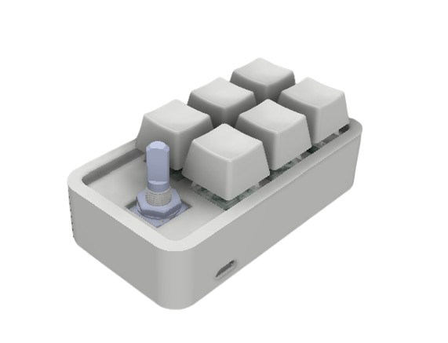
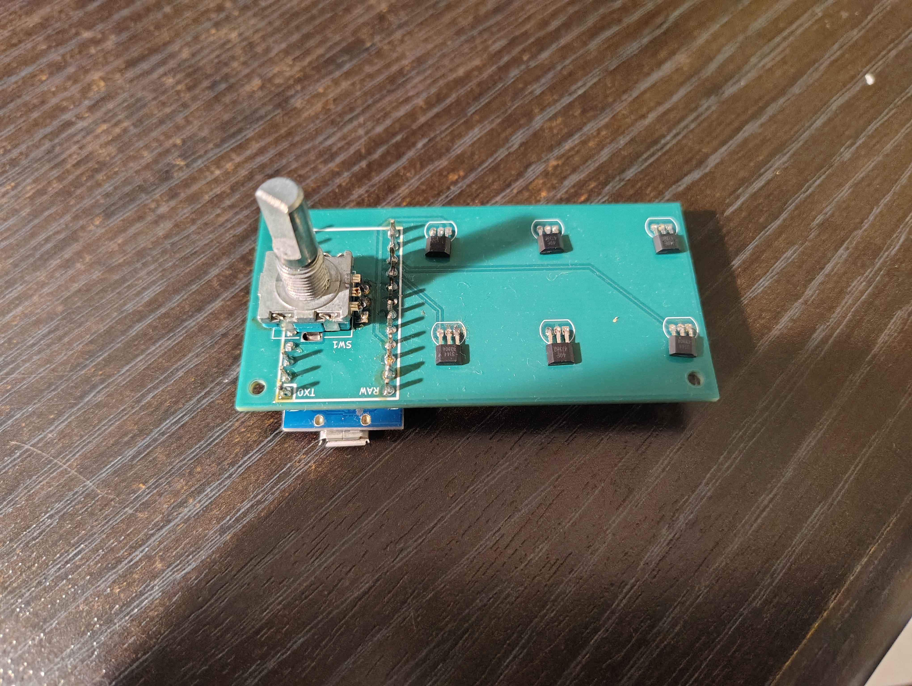
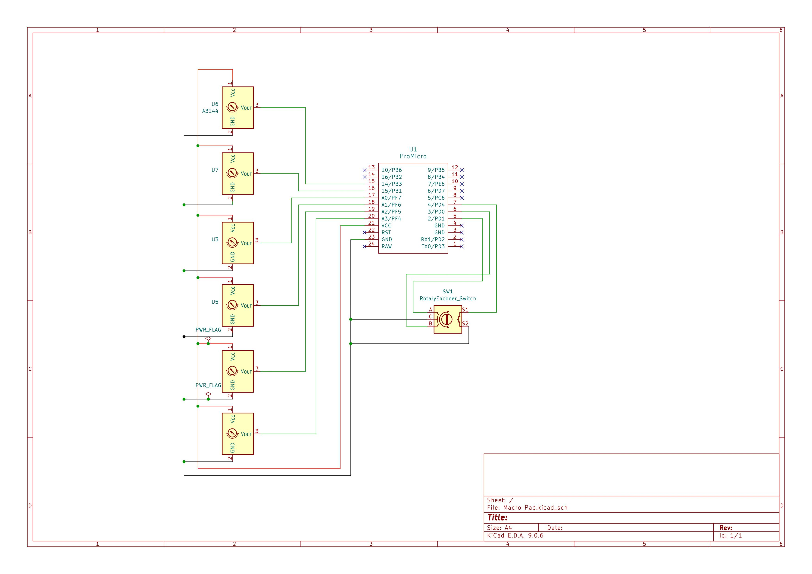
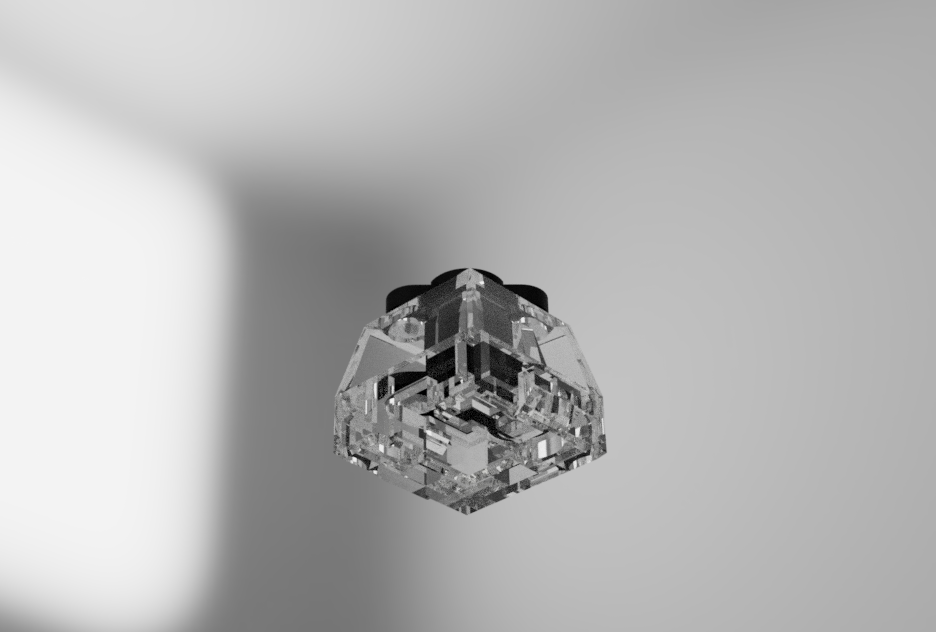

# Custom Hall-Effect Macropad


## Overview
A custom-engineered macropad utilizing entirely 3D-printed Hall-effect switches. This project demonstrates end-to-end hardware design, from schematic capture and PCB layout to physical assembly and mechanism tuning. [cite_start]The hardware serves as a development platform for writing custom peripheral firmware in C++ and Rust[cite: 4].

<div align="center">
  
</div>

## Current Status & Next Steps
**Hardware V1 is fully assembled and mechanically functional.** The custom PCB has been fabricated, populated, and soldered. The 3D-printed magnetic switches are currently undergoing physical fine-tuning to optimize the keystroke smoothness and actuation tolerances. 

**Immediate Next Steps:**
* [cite_start]**Firmware Architecture:** Drafting the low-level firmware in C++/Rust [cite: 4] to handle analog matrix scanning and switch debouncing.
* **Actuation Calibration:** Implementing dynamic actuation point calibration based on the analog Hall-effect sensor outputs.
* **Enclosure Design:** Finalizing the CAD for the external housing.

## Hardware Specifications
* **PCB Design:** Custom 2-layer board designed in KiCad.
* **Switches:** Custom 3D-printed housings utilizing Hall-effect sensors and permanent magnets for frictionless, adjustable actuation.
* **Manufacturing:** Routing, ground pours, and component placement optimized for hand-soldering and mechanical stability.

## Repository Structure

This repository contains the complete hardware definition and firmware files.

* `/Hardware`
    * `/Gerbers` - Ready-to-manufacture fabrication files (Copper, Mask, Silkscreen, Edge Cuts, Drill files).
    * `Macropad Schematic.pdf` - High-resolution electrical schematic for quick review.
    * `/KiCad_Project` - Raw `.kicad_pro`, `.kicad_sch`, and `.kicad_pcb` source files.
* `/CAD`
    * .STL files for the 3D-printed switch mechanisms.
* `/Firmware`
    * `main.cpp` - Firmware source (PlatformIO / Arduino framework)
    * `config.h` - Pin map, keymap, and tuning constants
    * `README.md` - Build, flash, tuning, and troubleshooting guide

## Firmware Quick Start

```bash
pip install platformio
pio run -t upload        # from the repo root, Pro Micro plugged in
pio device monitor       # 115200 baud; type 'h' for tuning commands
```

See [Firmware/README.md](Firmware/README.md) for the pin map, key remapping, sensor tuning, and troubleshooting.

## Visuals & Renders

| PCB Soldered| Schematic Design | Switch Render | 
| :---: | :---: | :---: |
|  |  | 